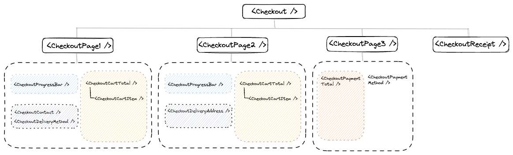

## Intro

Flour Power is a homegrown bakery in Singapore who specialises in cookie creations. Founded in 2016, they are also a social enterprise that advocates for inclusive practices in the workplace and society at large. As such, they work alongside individuals with special needs or those recovering from mental illness to create their delectable bakes.

As part of the UX Team's project, they have came up with a protoype of revamping the website, so as to create and raise more awareness for Flour Power and their mission. We, a team of 5, have received the final protoype from UX Team and have endeavour to build out a working application closely aligned to the final prototype.

In this application, a user will be able to navigate the various pages to understand more about Flour Power and its offerings and moreso, to browse the delectable bakes available for purchase.

## Technologies Used

1. Built using React, Express, MongoDB and Node
<ul>
   <li>CRUD functions</li>
   <li>React Router to create Checkout, Enquiry Form and Products pages</li>
   <li>useState hooks to track states</li>
   <li>useContext hooks to read and subscribe to states and functions</li>
</ul>

2. Tailwind CSS and React Icons for styling

3. React Slick for carousels on HomePage and About Us pages

## Hierarchy

## Wireframe

# Initial Discussions

## User Stories

We have 2 main groups of users. In general, users should be able to:

1. Navigate through the various pages via the navbar

2. Interact with the website via buttons that bring them to relevant sections of other pages

The first group are users who are shopping for cookies and would like a fuss free shopping experience through the website. To add on, they should be able to:

3. Browse all bakes available for purchases

4. Select various offerings for each bake, such as specific packaging, weight and quantity of some cookies

5. View the cart of what has been added so far

6. Proceed to checkout pages

7. Complete pertinent information in checkout forms such as delivery address, delivery methods

8. Select payment methods and receive a confirmation upon success

The other group of users are people who are interested in bulk orders or customization options. They would need a clear direction to information they need and quick access to send out enquiry requests for their purchase. They should be able to:

3. Understand the options available for bulk orders, as well as customization examples

4. Guided to a comprehensive enquiry form that cater to their needs

## General Approach

1. Backend
   a. Product: contains product name, description, about information, and price options with weight and packaging combination, as well as image of packaging options
   b. Checkout
   c. Enquiry Form

3. Frontend

## Limitations & Future work

Due to the time frame of 5 days given to complete this project, there were a few items which we would love to complete but was unable to do so. Refer to the following:

1. In the "Shop" page, some products' quantity, packaging and price have been mocked up Hence to align to reality, we would need to obtain the exact offerings offered by the shop and replace them.

2. The application of 'Gift card or discount code' is currently not enabled.

3. The payment methods listed are not connected to any payment gateways.

4. There is no client model authentication where client can log in to upload / edit product offerings.

5. Images are not encoded in the database and fetched for display yet.
